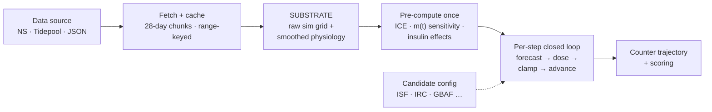
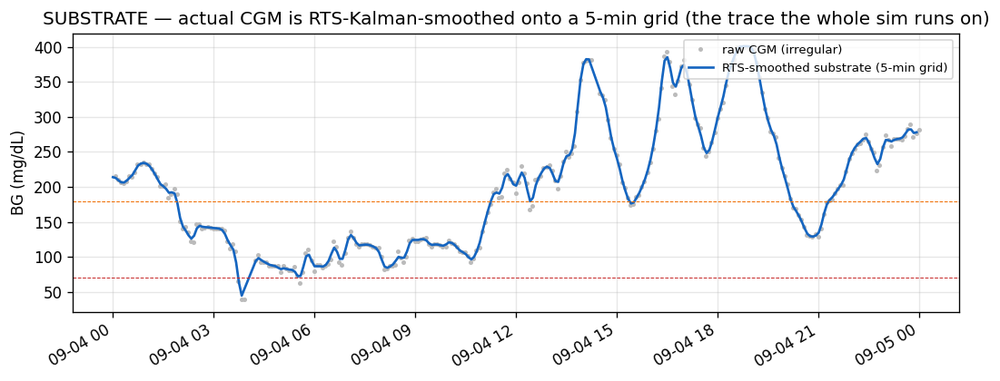
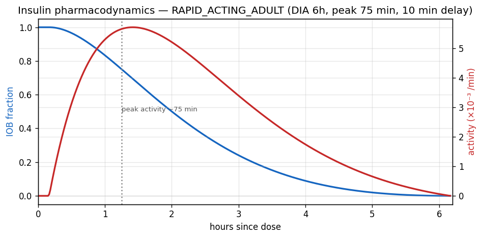
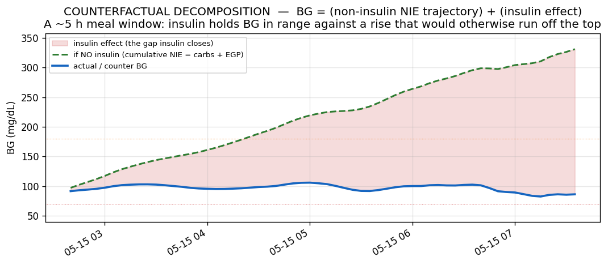
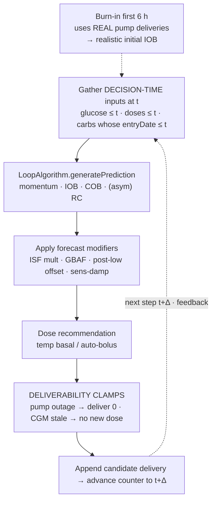
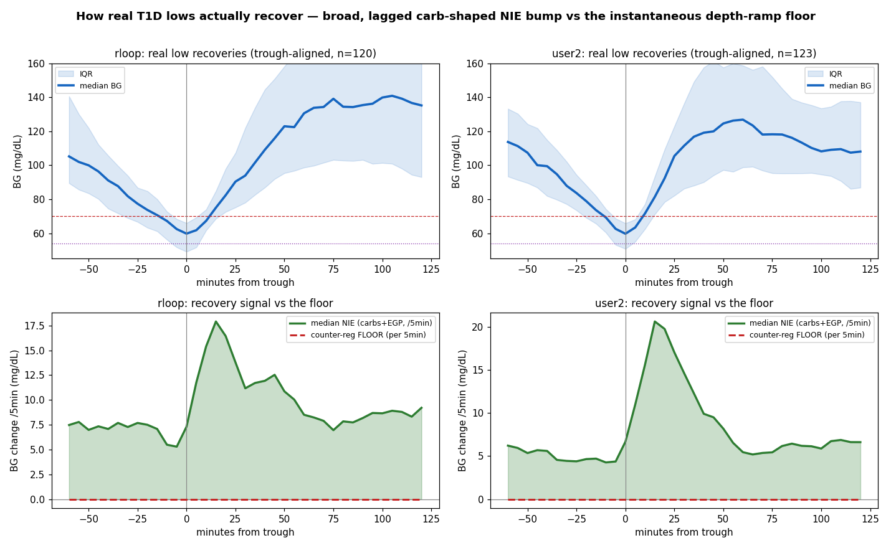
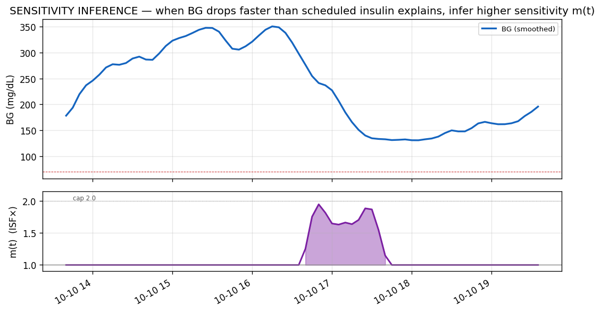
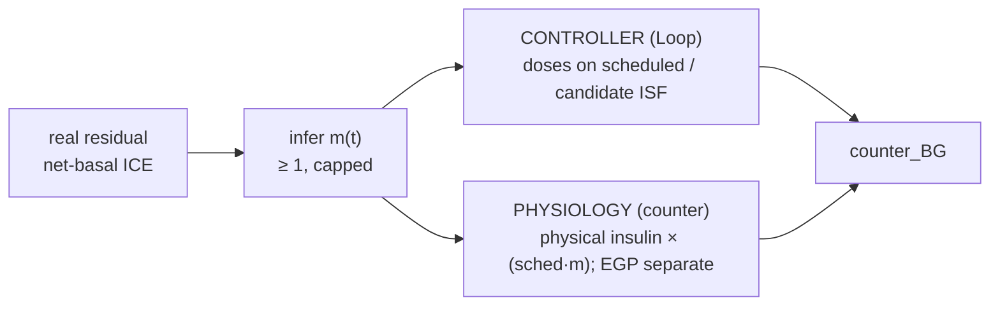
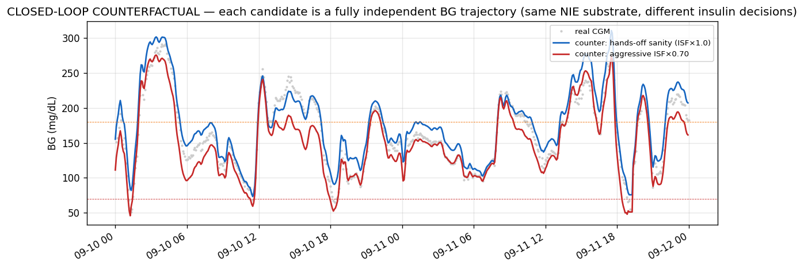
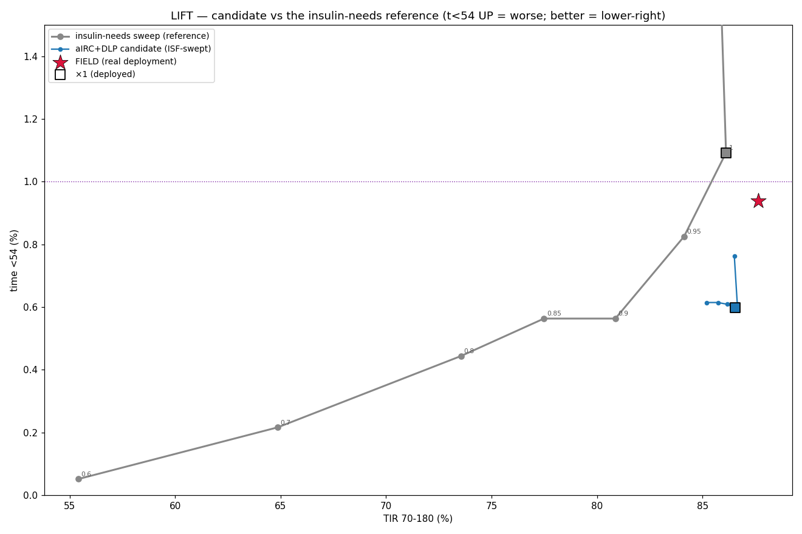

# LoopEval Closed-Loop Simulator — Technical Guide

> A technical primer on how the simulator works — data, the counterfactual physiology, the
> closed loop, the sensitivity-fidelity model, disruption handling, and how candidate
> algorithm changes (Loop *and* OpenAPS) are scored. **Living document** — kept current as the
> evaluator evolves.

*Last reviewed 2026-08-04. Renders on GitHub: flowcharts are Mermaid, callouts are GitHub
alerts, figures are the PNGs in this folder.*

## Contents

1. [What this is & why](#1-what-this-is-and-why-it-exists)
2. [Architecture at a glance](#2-architecture-at-a-glance)
3. [Data pipeline & cache](#3-data-pipeline--cache)
4. [The substrate](#4-the-substrate--what-the-sim-actually-runs-on)
5. [The insulin model (PD)](#5-the-insulin-model-pharmacodynamics)
6. [The physiological counterfactual](#6-the-physiological-counterfactual)
7. [The closed loop, step by step](#7-the-closed-loop-step-by-step)
8. [Counter-regulation floor](#8-counter-regulation-floor-a-rescue-carb-proxy)
9. [Sensitivity-inference (fidelity)](#9-sensitivity-inference-the-fidelity-model)
10. [EGP separation & decoupling](#10-egp-separation--the-controllerphysiology-decoupling)
11. [Disruption handling](#11-disruption-handling-pump-outages--cgm-gaps)
12. [Candidate levers](#12-candidate-levers-the-algorithm-changes-you-can-test)
13. [A worked counterfactual](#13-a-worked-counterfactual)
14. [Metrics & scoring](#14-metrics--scoring)
15. [The analysis layer](#15-the-analysis-layer--what-you-do-with-the-sim)
    - [15.1 Episodic (event-windowed) eval](#151-episodic-event-windowed-evaluation)
16. [Principles & traps](#16-methodological-principles--traps)
17. [Validation](#17-validation)
18. [Parameter reference](#18-parameter-reference)

---

## 1. What this is, and why it exists

LoopEval estimates the likely therapy impact of a change to the **Loop** closed-loop insulin
algorithm (or its settings) *before* the change is ever tried on a person, by replaying it
against a real person's historical CGM + insulin data. It is safety-critical software: insulin
dosing errors cause hypoglycemia, which can be immediately dangerous. The guiding optimization
target is to **increase Time-in-Range (70–180 mg/dL) while keeping severe-low (<54) time as low
as possible** — ideally both improve. This is a **heavily-weighted trade-off, not a hard
gate**: reducing lows is the priority and a rise in <54 is a serious cost, but a small increase
can be worth a large TIR gain. Both sides are always reported.

The tool has three conceptually distinct modes. This guide is about `simulate` — the
closed-loop counterfactual — which is the primary tool for therapy-outcome questions.

| Mode | What it does | Answers |
|---|---|---|
| `evaluate` / `inspect` | Forecast replay: reconstructs Loop's predictions at historical timestamps, compares forecast curves to actual CGM. | Is the forecast biased? Where does the model diverge? |
| `bench` | A/B per-step dose-delta on the same observed trace. Fast; linearized counterfactual. | Quick diagnostic of dose deltas. *(Its TIR is **not** clinical evidence.)* |
| **`simulate`** | **Closed-loop counterfactual replay** — runs a candidate algorithm forward as an independent BG trajectory. | **How would TIR / lows actually change?** |

> [!NOTE]
> **Two dosing engines.** The candidate that drives the closed loop is pluggable (the
> `DosingEngine` abstraction). Besides **Loop**, the simulator can drive **OpenAPS / oref** (the
> algorithm behind Trio, via the standalone `OpenAPSSwift` package) as the candidate — so a whole
> *different algorithm* can be compared against Loop on the same person's real data and the same
> NIE substrate. Both engines go through the identical substrate, scoring, and disruption
> handling, so the comparison is apples-to-apples. See [§12](#12-candidate-levers-the-algorithm-changes-you-can-test).

---

## 2. Architecture at a glance

The pipeline turns a data source + a date range + a candidate config into a counterfactual BG
trajectory and outcome stats. Everything downstream of the **substrate** is deterministic.



The conceptual heart: the simulator does **not** try to model glucose physiology from first
principles. Instead it extracts the person's real non-insulin glucose dynamics from history (the
**ICE**, below) and replays them, substituting only the candidate's insulin decisions. *"The
user's real-day physiology, with different insulin."*

---

## 3. Data pipeline & cache

Data is pulled from the Nightscout v1 API (`NightscoutClient`) and cached on disk under
`~/.loop-eval/cache/`, keyed by host + epoch range (e.g. `glucose_<host>_<start>_<end>.json`).
Four streams are fetched: **glucose** (CGM entries), **doses** (treatments → boluses + temp
basals), **carbs** (carb entries, with each entry's real `absorptionTime`), and **therapy** (the
time-of-day schedules: ISF, basal, carb ratio, targets, insulin type).

> [!NOTE]
> **Chunked fetch.** A full year of CGM is ~105k entries. A single request 504s on slower hosts,
> so `fetchEntries` requests in **28-day chunks** and concatenates (transparent to the cache,
> which still stores one file for the requested interval).

The **therapy schedule** is expanded across the whole window (the "current-profile backfill").
This is fine for "replay these proposed settings" but is *not* proof of the historically-active
settings.

### Input sources — Nightscout is not the only one

The four streams reach the sim through a `DataSource` abstraction, so the counterfactual is
source-agnostic. Three paths feed it:

- **Nightscout** (`--nightscout-url`, default) — the chunked/cached fetch above.
- **Tidepool Big Data Donation Project** — donor data pulled from Databricks
  (`loopeval_analysis.tidepool`: `conn`/`etl`/`cohort`) and ETL'd into the four EvalCore JSON
  files, then replayed. This opens the sim to thousands of real DIY-Loop donors beyond the
  hand-curated Nightscout sites.
- **Any JSON directory** — `--data-dir <dir>` (`JSONFileDataSource`) reads
  `glucose/doses/carbs/therapy.json` directly. Every non-Nightscout dataset (Tidepool, synthetic,
  hand-built) enters the identical downstream pipeline this way, so substrate, scoring, and
  disruption handling are unchanged.

> [!WARNING]
> **Tidepool ETL data traps** (fixed 2026-07-30, `tidepool/etl.py`). Two bugs the BDDP path
> surfaced — both silent, both cohort-wide:
> 1. **HealthKit bolus double-count.** DIY-Loop mirrors every bolus to Apple Health, so
>    `device_data` stores each bolus twice (`com.loopkit.Loop` + `com.apple.HealthKit`, different
>    `id`) — id-dedup can't catch it → 2× bolus/TDD and a corrupted ICE (the sim runs high).
>    Collapse by `(second, amount)`.
> 2. **Local-midnight schedules.** Pump-settings schedules (basal/ISF/CR/target) store `start` as
>    ms-from-*local*-midnight; expanding at UTC midnight shifts the whole schedule by the donor's
>    offset (~6–7 h for US-Mountain) → wrong scheduled basal/ISF/CR at every wall-clock time.
>    Expand on local-day boundaries (DST-aware) from the donor's `pumpSettings.timezone`.
>
> Any direct `device_data` query for TDD/dosing needs the same two corrections.

---

## 4. The substrate — what the sim actually runs on

The raw CGM is resampled onto a uniform **5-minute grid**. As of **2026-06-14** the substrate is
**split into two traces on the same grid**:

- **`physGlucose` — RTS-Kalman-smoothed** (`buildSmoothedGrid`, gated on `kalmanSmoothing`,
  default ON). Used **only for patient-physiology estimation**: the ICE and the sensitivity
  multiplier *m(t)* ("k"). Low-noise "ground-truth" space for inferring physiology.
- **`simGlucose` — what the simulator runs on**: Loop's decision-time glucose input, the
  counterfactual trajectory, and the outcome stats. **Default (`simRawGlucose`, on): the original
  noisy CGM**, resampled onto `physGlucose`'s exact timestamps (`rawGridMatching`) so the per-grid
  *m(t)* stays index-aligned. So the controller is evaluated against the *real noisy CGM it would
  actually dose on*, while sensitivity is still inferred from the smoothed trace.
  `--no-sim-raw-glucose` = legacy all-smoothed sim; `--no-kalman` = everything raw.



*The RTS smoother removes single-sample CGM noise and lands the trace on a clean 5-min grid (now
`physGlucose`, the physiology trace). Single missing samples are interpolated; gaps of ≥2 samples
are omitted (then handled by the stale-guard / disruption logic).*

> [!WARNING]
> **Deliberate future-leak — physiology only.** The RTS *backward* pass uses future samples, so
> the smoothed BG at time *t* is informed by observations after *t*. This is intentional, and now
> confined to `physGlucose` (ICE + *m(t)*) — the **simulator/controller runs on the raw causal CGM
> by default**, so Loop's decision-time input is no longer future-leaked. Fairness holds because
> baseline and every candidate share the identical substrate(s), so any remaining future
> information is common-mode and cancels in every candidate-vs-baseline delta. **Absolute numbers
> under the raw-sim default are not comparable to the 2026-05-20→06-13 all-smoothed runs** (raw
> noise pushes t<54 up / TIR down); deltas/rankings hold.

> [!NOTE]
> **Sensor cap (`--sensor-cap-mgdl`, default 400).** The glucose the *algorithm* sees is clipped
> at the sensor's reporting ceiling — real Dexcom G6/G7 and Libre peg at ~400 mg/dL, so no
> controller ever sees a higher value. The cap is applied to both the baseline and candidate
> inputs; the counter trajectory and scoring still use the uncapped values. Without it, a
> counterfactual that runs very high (e.g. an algorithm that wedges after a pump outage) could feed
> an unrealistically high reading into the controller and distort its response. Common-mode, so
> deltas are unaffected.

---

## 5. The insulin model (pharmacodynamics)

Insulin action uses Loop's exponential insulin model. The default is `RAPID_ACTING_ADULT`: 6 h
duration of action (DIA), peak activity ~75 min, 10 min delay. The **activity curve** (rate of
glucose-lowering) and the **IOB curve** (insulin remaining) are derived from it.



*A unit's effect ramps in over ~10 min, peaks near 75 min, and tails out to ~6 h. The total
glucose-lowering of one unit equals the ISF (mg/dL per U); the PD curve only sets the *timing*.
This lag is fundamental — it's why even perfect foresight can't fully pre-empt a sharp carb spike.*

Insulin glucose-effects are computed via `glucoseEffects` over the dose history and the ISF
schedule. A key subtlety is how basal is accounted: Loop uses **net-basal units**
(`volume − scheduledBasal×duration`). Delivering *more* than scheduled basal is BG-lowering;
delivering *less* (suspending) is modelled as an **EGP credit** — a positive (BG-raising)
contribution representing endogenous glucose production no longer covered by basal. (This
net-basal convention has important consequences for the fidelity model — see
[§10](#10-egp-separation--the-controllerphysiology-decoupling).)

---

## 6. The physiological counterfactual

The core idea (CF mode, `--candidate-counterfactual`). At each step the simulator advances a
counterfactual BG, `counter_BG`, by adding two things: the glucose effect of the **candidate's**
insulin, and the person's observed **non-insulin** glucose dynamics (the ICE).

#### ICE — Insulin Counteraction Effect

The ICE is pre-computed once from the *real* day: it's the observed BG velocity minus the
modelled effect of the *real* insulin.

```
ICE(t) = v_BG_observed(t) − v_insulin_modelled, real-doses(t)
```

So the ICE captures everything that moved BG that *wasn't* the modelled insulin: carb absorption,
endogenous glucose production, exercise, dawn phenomenon, sensor surprise. It is the person's
"real-day physiology" distilled into a per-step velocity, and it is **dose-independent** — it does
not change when we change the candidate's dosing.

#### The counter advance (the recurrence at the heart of the sim)

```
counter[t+Δ] = counter[t] + insulinEffect(candidate doses) + ICE(real) + counterReg
                            └── candidate's decisions       └ borrowed    └ glucose
                                                              physiology     defense (§8)

Δ = 5 min · integrated step-by-step from a 6 h burn-in seed
```

Because the ICE is reused verbatim while the insulin term is recomputed from the candidate's
doses, the counterfactual is **bounded and IOB-consistent**: it can't drift to absurd values, and
it answers exactly "what if Loop had dosed differently, on this person's real day?"



*Decomposition over a ~5 h meal window. The green dashed line is the no-insulin trajectory
(cumulative NIE = carbs + EGP); the red band is the insulin effect pulling BG down to the actual
(blue). The sim keeps the green part fixed and re-draws the red part for each candidate. (Shown
over a few hours on purpose: with no insulin at all the green line keeps climbing off the chart —
that runaway is exactly the scale of the continuous work insulin is doing.)*

> [!NOTE]
> **Non-CF (linear-PD) mode** also exists (omit the flag): `counter = actual − Σ(Δdose × ISF ×
> PD)`. It is accurate only for *small* per-step deltas (rules firing ±0.05–0.10 U); for
> whole-algorithm comparisons use CF mode.

---

## 7. The closed loop, step by step

The candidate side is a **sequential per-step walk** (5-min steps). Critically, the candidate runs
its *own* Loop: at each step it forecasts from its accumulated decisions and chooses a dose, which
feeds the next step. Both baseline and candidate go through one canonical dose path (`simStepDose`
→ `LoopAlgorithm.generatePrediction`) so that identical configs give Δdose ≈ 0 (see
[§17](#17-validation)).



#### Decision-time replay (no future leak)

Loop's prediction sees only what was available at *t*: glucose and doses up to *t*, plus carbs
whose **entryDate** (DB insert time, not the back-dated meal time) is ≤ *t*. It does **not** see
future insulin or future carb entries unless `--oracle-future-inputs` is set (debug only). The one
deliberate exception is the substrate's RTS smoothing ([§4](#4-the-substrate--what-the-sim-actually-runs-on)).

The first 6 h is a **burn-in**: real-pump deliveries drive the sim so the candidate's first real
decision has a fully realistic recent dose history (correct initial IOB). Counterfactual
divergence begins after burn-in.

---

## 8. Counter-regulation floor (a rescue-carb proxy)

When `counter_BG` falls below an onset threshold, a positive BG velocity is added that ramps with
depth below onset, capped. It is applied **only when the counterfactual itself is below onset** and
as a **difference from the real trace**:

```
if counter < onset:  crVelocity = defense(counter) − defense(real_BG)
  where  defense(bg) = min( gain × (onset − bg), maxRate )  for bg < onset, else 0
```

Two subtleties make this correct. **(a) Differenced against reality.** The real day's own rescue is
already in the ICE (a treated low recovers in the real trace → positive ICE), so adding the
absolute defense on top would double-count it and break identity; subtracting `defense(real_BG)`
makes the term **0 at identity** (counter ≡ real) and gives only the *incremental* defense a
deeper-than-real low deserves. **(b) Gated on the counterfactual being low.** The term fires only
when `counter < onset`. Without this gate a *high-running* counterfactual (a less-aggressive /
lows-reducing candidate, correctly above a real low) would shed the full `defense(real_BG)` and get
driven implausibly *below* the real substrate — a systematic downward bias against exactly the
candidates we care about. *(Gate added 2026-07-16, commit `876a08a`; the difference form was
`4826d3c`.)*

**The floor is OFF by default** (`--counter-reg-onset` defaults to `0`; the floor code only runs
when onset > 0). When enabled, the CLI defaults are `gain 0.2 / max 6.0`. It exists because, before
it, counterfactual lows could run away to physically-impossible values (e.g. −100 mg/dL), which
made severe-low stats meaningless — so the canonical *whole-trace* outcome sims turn it on
(onset ~54) to keep severe-low stats physical. But enabling it is an **evaluation choice, not a
default**: some evaluations deliberately leave it off — the
[episodic event eval (§15.1)](#151-episodic-event-windowed-evaluation) does, so candidate-induced
deep lows are counted un-truncated. It is best understood as a crude proxy — and the name
"counter-regulation" is a bit of a misnomer, for two reasons.

> [!WARNING]
> **In T1D the defense is rescue carbs, not endogenous counter-regulation.** The glucagon response
> to hypoglycemia is characteristically lost in established T1D, and the epinephrine backup is
> blunted by recurrent lows (HAAF / impaired awareness). The one endogenous lever that does
> remain — less insulin → less suppression of hepatic glucose output — is *already* captured by the
> insulin model when a candidate suspends. What actually brings these lows back up is the person
> **eating**.

**And the real rescue is already in the model — as positive ICE.** A treated low recovers because
carbs were consumed; that recovery is in the real BG trace, so it rides into every counterfactual
as a positive ICE/NIE bump at that wall-clock time (and, with the fidelity `m`, cleanly so —
descent attributed to insulin, recovery to carbs). So in the tracking regime the floor isn't doing
the recovering; the ICE is.



***What real lows actually do** (243 episodes, two users, trough-aligned). Top: the median low
bottoms at ~60 mg/dL and climbs back over ~10–15 min. Bottom: the recovery is a broad, carb-shaped
positive-NIE bump (~135–150 mg/dL over 45 min) — i.e. rescue carbs, already carried by the
substrate. The floor (red dashed) is inactive for the typical low (onset 54 is below the median
trough of 60) and, where it does fire at depth, it is faster and more abrupt than any real
recovery.*

So what is the floor legitimately for? Only the **incremental** rescue at a *deeper-than-real* low.
If a candidate doses more and drives the counter to 35 when the real day bottomed at 60, the real
ICE supplies only the carbs eaten *for the 60* — it cannot supply the extra carbs the person would
have taken at 35. The floor stands in for that. Two known limitations of the current form:

- **Shape/timing is unphysical.** Rescue carbs act with a ~10–15 min lag and a gradual absorption
  curve (observed max recovery ~2.6–3.3 mg/dL/min); the floor is an *instantaneous* depth-ramp that
  at 40 mg/dL adds ~5.6 mg/dL/min. It therefore **over-recovers deep counterfactual lows →
  understates deep `t<54` → makes dose-more candidates look safer than they are** (the §1 direction
  we most want to avoid).
- **Double-counting in genuine real severe lows is largely handled** by the difference form above
  (it references the real BG via `defense(real_BG)`, so a counter merely tracking a real sub-54 low
  adds ~0 incremental defense). What remains is the shape/timing mismatch and the residual
  approximation error of attributing exactly `defense(real_BG)` of the real trace's change to
  counter-reg.

> [!NOTE]
> **Mirror image of the rescue-carb confound.** The flip side is in the *prevention* regime: a
> candidate that prevents a low still inherits the rescue carbs the person really ate (fixed in the
> ICE) → a spurious rebound high. Both come from the same root — rescue carbs are baked into the ICE
> at a fixed time and amount, and the counterfactual can't re-derive them for a different
> trajectory. The faithful fix for both is a **BG-triggered rescue-carb model** (inject a realistic,
> lagged carb-appearance curve when the counter crosses a treat threshold, and remove the real
> rescue from the ICE so it isn't double-applied). That's a planned replacement for this floor;
> until then, read deep-`t<54` deltas as mildly optimistic. *(Characterization:
> `runs/2026-06-07-creg-recovery/`.)*

---

## 9. Sensitivity-inference (the "fidelity" model)

The plain counterfactual has a subtle bias. The ICE is a *residual* computed at the **scheduled**
ISF. If the person was actually more sensitive than scheduled at some moment, the modelled insulin
under-counted the true drop, and that leftover insulin-driven drop gets dumped into the ICE as if
it were dose-independent physiology. When a candidate then changes the dose, this matters: the
candidate's dose delta is applied at the scheduled ISF, not the person's true local sensitivity.

Fidelity mode (`--candidate-infer-sensitivity`) corrects this. Per step, over a trailing ~30 min
window, it measures how much BG actually moved versus how much the scheduled-ISF insulin explains.
**If BG is still dropping after subtracting modelled insulin, the insulin must have been more
effective** — so it scales ISF up by a multiplier `m(t)` just enough to absorb that negative
residual (never past it, so it never manufactures a rise):

```
m(t) = clamp( v_BG / v_insulin , 1 , m_max )    — only where insulin is genuinely active (else m=1)
```



*Where the substrate drops faster than the scheduled insulin accounts for, `m(t)` rises above 1
(purple), capped at 2.0. The cap is the "can't subtract more insulin than is physically present"
ceiling — when little insulin is active the unexplained drop stays in the additive ICE (the
exercise / low-IOB case).*

Why `m` only goes up (≥1): a downward residual is, physiologically, almost always insulin (the only
thing that *actively removes* glucose; EGP can only stop raising it, carbs are positive). Validated
against the real field on the period the device ran IRC: the fidelity sim reproduces the actual low
time, while the plain (m≡1) sim under-counts it by ~40%.

> [!TIP]
> **Field validation of the default — raw per-step m is the faithful one (2026-06-07).** The
> default fidelity model is the **raw per-step** `m` (cap 2.0, 30-min trailing window — no
> smoothing). A cross-user field check confirmed it: replaying with the real user boluses passed
> through (so sim dosing tracks the field), the simulator's time-low lands almost exactly on the
> real record on the cleanest dataset (a heavy meal-announcer, where sim and field dosing match
> within ~8 mg/dL mean). The residual severe-low gap on a sparser-announcing user traced to *dosing
> character* (the field's deep crashes are discrete meal-bolus spikes the automated sim doesn't
> reproduce), **not** to under-attributed sensitivity — confirmed by closing the mean-BG offset and
> re-checking.

> [!NOTE]
> **Smoothing knobs exist but are OFF by default.** `m(t)` solved per-step is spiky (sensitivity is
> really a slow latent state), so two optional smoothers are available:
> `--candidate-infer-sensitivity-smooth-min` (carry-latent Gaussian) and
> `--candidate-infer-sensitivity-smooth-prior` (shrinkage toward 1). They are **identity-safe**
> (they only scale a term that is zero when candidate doses ≡ real). But the same cross-user check
> found smoothing *over-attributes* — it overshoots the real low time on the clean dataset — so the
> validated default remains raw per-step `m`. The smoothers stay available for research, off by
> default.

---

## 10. EGP separation & the controller/physiology decoupling

Two correctness requirements when scaling sensitivity:

#### (a) Scale only the active insulin, not the EGP credit

Under net-basal accounting, a sub-basal (suspended) delivery shows up as a *positive* EGP-credit
term. Naively scaling the whole net effect by `m>1` would magnify that positive term and push the
forecast *up* — nonsensical. So the fidelity physiology is computed over **physical delivery** (the
always-lowering effect of the absolute insulin volume) with the EGP held separate at the scheduled
ISF (`.physicalDelivery` decomposition). `m` scales only the physical-insulin term; EGP rides,
unscaled, in the dose-independent residual.

#### (b) The controller doesn't know the true sensitivity; the body does

Loop's *controller* decides doses on what it **believes** (the scheduled ISF, or a candidate ISF).
The *physiology* responds at the true sensitivity (scheduled × `m(t)`). The fidelity model keeps
these two paths separate, so changing the controller's ISF belief doesn't silently change the
body's response.



*m feeds the physiology (truth); the controller keeps its own belief — they're decoupled.*

> [!TIP]
> **Bit-exact identity (the regression guard).** The fidelity counter-advance is
> ```
> counter[t+Δ] = counter[t] + realBGdelta + m·(candPhys − realPhys) + counterReg
> ```
> where `candPhys` and `realPhys` are the *physical* active-insulin effects (EGP zeroed) of the
> **candidate's** doses and the **real** doses. When the candidate's doses equal the real doses,
> `candPhys = realPhys`, so the entire `m` term is **exactly zero for any m** and the counter
> reproduces the substrate. That's the guarantee that lets the sensitivity knobs (cap, window, and
> the off-by-default smoothers) change the patient model *without* ever perturbing a no-op
> candidate — and, with the single shared dose path ([§7](#7-the-closed-loop-step-by-step)), why
> identical baseline/candidate configs give Δdose ≈ 0 and counter ≡ sanity (§17). *(Note: this
> physical/EGP-separated form is distinct from the plain CF advance in §6, which uses net-basal
> insulin + additive ICE; the fidelity path is not a drop-in `m=1` reduction of it.)*

---

## 11. Disruption handling (pump outages & CGM gaps)

Two structurally different real-world events get explicit handling, both in the SIM and in scoring.

| | Pump outage (pod off) | CGM gap |
|---|---|---|
| **Detected from** | Site-change events + dose-record-gap heuristic → `--outages-csv` | ≥2 missing 5-min samples (omitted from the grid); `--cgm-stale-guard-min` |
| **In the sim, DURING** | delivery clamped to **0** (no insulin while the pump is physically off) | no *new* dose adjustment (Loop won't dose on stale data); scheduled basal continues |
| **When it ends** | resumes its own closed-loop dosing immediately | resumes the moment CGM returns |
| **In scoring** | only the disruption **interval** itself is excluded — **not** the recovery window (policy 2026-05-26) | ← same |

> [!NOTE]
> **Policy change (2026-05-26):** earlier scoring also excluded the 3 h *after* each disruption.
> That was removed. Because the sim clamps only *during* an outage and then resumes its own dosing,
> the post-disruption trajectory genuinely measures the candidate ("pick up dosing when the pump
> comes back" and score it) — and in hands-off mode there's no real catch-up bolus to contaminate
> it. The exclusion mask is data-level (identical for baseline and candidate → fair); `post_hours`
> now defaults to 0.

> [!NOTE]
> **CF re-anchor across long CGM gaps.** A candidate that has already diverged before a multi-hour
> CGM gap would keep integrating ICE across the gap with no CGM to correct it, and can blow up
> (BG → 700+). So across a gap longer than `cfGapReanchorSec` (default **30 min**) the
> counterfactual is **re-anchored to the real CGM at gap-end** before resuming divergence.
> Identity-safe — a no-op candidate re-anchors to the trace it was already tracking, so Δ stays 0.
> *(`974b384`, `46688a1`.)*

---

## 12. Candidate levers (the algorithm changes you can test)

A "candidate" is an `EvalConfig` + CLI flags expressing one change. The key levers:

| Lever | Flag | What it changes |
|---|---|---|
| **Insulin-needs dial** | `--candidate-insulin-needs` | Loop preset-style single aggressiveness knob `f`: basal ×f, ISF ÷f, CR ÷f together (f=0.5 → half basal, double ISF/CR = less insulin). **This is the reference-sweep axis for lift (§15)** — the realistic single dial, and a much stronger baseline than ISF alone. |
| ISF multiplier | `--candidate-sensitivity-multiplier` | Flat scale on the controller's ISF (<1 = more aggressive / dose more). A weaker aggressiveness axis than insulin-needs (corrections only). |
| Basal-rate multiplier | `--candidate-basal-rate-multiplier` | Scale the scheduled basal profile. Changes the belief (delivered basal *and* the forecast's net-basal reference), not just the output — so it reaches fasting/non-meal lows that ISF corrections can't. |
| Manual-bolus mode | `--candidate-manual-bolus-from-recommendation` (**DEFAULT ON**) · `-rec-scale` | Replace each real manual bolus with the candidate's *own* recommended bolus (self-consistent with candidate state; makes the aggressiveness sweep behave physically). `-rec-scale 0.5` delivers half of it (models meal under-bolusing). Pass `--no-…` for the old IOB-resize passthrough (more field-faithful for single-decision fidelity work). |
| Application factor | `--candidate-application-factor` | Fraction of the computed correction delivered per cycle (Loop default 0.4). |
| GBAF | `--candidate-gbaf` (+ anchors/factors) | Glucose-based application factor: ramps the app-factor up with BG — aggressive only when high (fidelity-stable on lows). |
| Integral RC | `--candidate-integral-rc` | Integral retrospective correction (a PID-like term on accumulated forecast error). |
| Asymmetric IRC | `--candidate-irc-drop-scale / -rise-scale` | Sign-dependent IRC gain — damp the rise response, amplify the drop response (lows-protective). |
| Asymmetric momentum | `--candidate-asymmetric-momentum` | Turns off positive momentum fast on a downtrend. |
| Post-low protector | `--candidate-postlow-suppress / -isf-mult` | After a recent low, lower the forecast / raise ISF (slow-off) to damp the rebound re-dose. |
| Uncertainty cap | `--candidate-uncertainty-cap` (+ `-uncertainty-k`) | A unified dosing ceiling that replaces the application factor and the predicted-min gate. Per cycle, deliver at most the dose whose *worst-case* insulin effect (physical insulin × (1+`k`)) *with maximum basal suspension* still keeps the forecast ≥ a low threshold. `k` is the uncertainty knob (it plays AF's role: hedging the unknown future). Because it caps the dose *level* (not the rate), it does not wind up to 100% of need at a stable high. *(Built 2026-06-10; EvalCore-only, no fork.)* |
| Sensitivity inference | `--candidate-infer-sensitivity` | The fidelity physiology model (§9) — also a research substrate, not only a therapy lever. Tuning: `-max` (cap, default 2.0), `-window-min` (default 30), and the off-by-default smoothers `-smooth-min` / `-smooth-prior`. |
| **Double-low prevention** | `--candidate-sensitive-mode-tau-min / -gain` | An EWMA of recent *negative* discrepancy that raises effective ISF on subsequent cycles — damps re-dosing into the rebound *after* a low. A **leading lift lever** (paired with asymmetric IRC) on Loop datasets. |
| Predictive sens-damp | `--candidate-sens-damp-gain` | Causal sustained-ICE trigger → proactive ISF reduction before a low. |
| Forecast-offset (CSV) | `--candidate-forecast-offset-csv` | Per-step additive offset to the candidate's forecast, from a CSV — a general hook for testing an arbitrary "what Loop believes" shift (the §16 principle: modify the forecast, not the output). |
| **OpenAPS engine** | `--candidate-openaps` (+ `-oaps-*`) | Swap the candidate's whole dosing algorithm to oref/OpenAPS instead of Loop. Sub-flags expose oref knobs: `-oaps-threshold` (SMB safety floor), `-oaps-dynamic-isf` / `-oaps-sigmoid` (Dynamic ISF), `-oaps-smb-ratio`, `-oaps-preset-target`, etc. |
| Sensor cap | `--sensor-cap-mgdl` | Ceiling on the BG the controller sees (default 400 — real sensor behavior). §4. |

> [!NOTE]
> **oref / Trio fidelity.** Driving the OpenAPS engine *faithfully* (so a Loop-vs-oref comparison is
> real) meant matching Trio's internals: weighted-average TDD (`calculateTDD` with pulse-floored
> temp-basal segments), a time-varying **dynISF adjustment-factor schedule**, named **temp-target
> presets** (latest-wins, incl. Exercise targets), autosens fed a full 24 h pump history, CGM
> dedup-then-smooth (matching Trio Core Data), and running the sim in the **profile's timezone** so
> oref's day-boundary logic lines up. A golden-master oracle runs Trio's actual JS pipeline on raw
> Nightscout data as the reference.

---

## 13. A worked counterfactual



*Two candidates over the same 2-day real window. The hands-off sanity (ISF×1.0, blue) and an
aggressive ISF×0.70 (red) are each **independent closed-loop trajectories** built on the same ICE
substrate. The aggressive candidate runs lower (more insulin) — buying TIR but flirting with lows.
Note neither tracks the raw CGM (grey): they are *fully automated* counterfactuals (no manual meal
boluses).*

---

## 14. Metrics & scoring

Outcome stats are computed on the counter trajectory after the burn-in and after the
disruption-interval exclusion ([§11](#11-disruption-handling-pump-outages--cgm-gaps)). The headline
metrics, in priority order:

- **TIR** 70–180 mg/dL (maximize)
- **t<54** severe-low time, and **t<70** low time (minimize — heavily weighted; a rise is a serious
  cost weighed against the TIR gain, not an automatic veto)
- t>180, t>250; AUC<70, AUC>180; mean BG
- **IOB-at-crossing-54** (low-danger): `n_cross54`, `iob_cross54_med/mean/p90`,
  `iob_cross54_possum` — the net IOB the candidate carries into its severe lows (see callout below)
- total / net / max per-step dose deltas; `kept_frac` (fraction of samples surviving exclusion)

> [!TIP]
> **IOB-at-crossing-54 — a danger axis t<54 duration can't see.** The more committed insulin a
> candidate carries into a severe low, the more dangerous it is — it drives the low deeper and
> forces more rescue, *even at identical t<54*. Treated `t<54` duration is nearly flat vs
> IOB-at-crossing (rescue carbs truncate the low in real data; the counter-reg floor truncates it in
> sim), so it hides this. The committed insulin shows up instead in **depth/AUC<54** and directly in
> IOB-at-crossing. `score_counterfactual` reports it from the trace's per-step `candidateIOB`;
> `iob_cross54_possum` (∑ positive IOB across all <54 crossings) is the aggregate exposure — it
> scales with both how often the candidate goes low and how much insulin it carries in. Example
> (user1 90 d): a conservative Loop and an aggressive OAPS can both pass on t<54 framing yet differ
> ~5× on possum (8.6 vs 41.7).

Canonical scorer: `loopeval_analysis.scoring.score_counterfactual(trace, outages_csv,
cgm_gaps_csv)` (skips burn-in, applies the interval exclusion). Forecast-quality metrics (OPR/UPR)
are separate and used by the `evaluate` mode.

> [!NOTE]
> **Trace outputs for case studies.** Every `--trace-out` JSON also carries the canonical
> `delivery[]` stream (both arms, basal + bolus, auto vs manual) and per-step `patientIOBField /
> patientIOBCandidate` — both arms' delivered doses run through one shared patient insulin model, so
> the IOB comparison is fair and independent of any candidate IOB experiment. These feed the
> standard case-study panels (`loopeval_analysis.case_study.plot_case`; see
> [`../CASE_STUDIES.md`](../CASE_STUDIES.md)) — root-cause a surprising outcome number *there* before
> believing it. (The patient-IOB series is diagnostic only; dosing and scoring use the controller's
> `candidateIOB`/`baselineIOB`.)

> [!WARNING]
> **Severe-low metric caveat (sensor artifacts).** Real CGM contains **compression lows** — the
> sensor reads false-low (pegging at the 40 mg/dL floor) when slept on, then snaps back. These are
> physiologically impossible (huge instantaneous drops) and overnight-clustered, and they inflate
> the absolute `t<54`. The RTS smoother removes single-sample noise but not sustained 40-floor
> plateaus. They're common-mode across candidates (so deltas/rankings hold) but the *absolute* lows
> figures should be read with this in mind.

---

## 15. The analysis layer — what you do with the sim

A single (TIR, t<54) point is ambiguous, because most single levers just slide along one common
"aggressiveness" curve. The **lift** framework fits a reference curve from a dense sweep of that
aggressiveness dial, then scores each candidate by its **signed, axis-normalized closest distance
to the reference polyline** — **+** when it sits below-and-to-the-right (more TIR / less t<54 than
the dial reaches), **−** when above-left. Lift ≈ 0 = a slider; lift > 0 = a genuine structural
improvement. (This replaced an older "vertical TIR gap at matched t<54", which blew up wherever the
reference curve runs flat.) Rank a mechanism by the **mean lift over its own sweep**
(`frontier.summarize_mechanisms`), not a single point; plot with `frontier.plot_sweeps`.

> [!WARNING]
> **Sweep the insulin-needs dial, not ISF alone.** The reference dial should be
> `--candidate-insulin-needs f` (a Loop preset-style single knob: basal ×f, ISF ÷f, CR ÷f
> together), not `--candidate-sensitivity-multiplier`. An ISF-only sweep only touches correction
> dosing, so it floors high on t<54 (can't cut basal/meal lows) and thereby **overstates candidate
> lift** — much of what looks like lift against an ISF baseline is really just "this candidate
> delivers less insulin," which the insulin-needs dial does trivially. Measuring a "halve the meal
> boluses" lever against ISF-only showed +0.185 apparent lift that **evaporated to +0.036** against
> insulin-needs.



*Lift analysis (real user, fixed sim). Convention: x = TIR (right = better), **y = t<54 increasing
upward (up = worse)**, dotted 1% budget line, **better = lower-right**. The grey curve is the
insulin-needs reference; each candidate is swept over its ISF multiplier as a line — where it sits
below-right of the grey curve it has positive lift. Here aIRC+DLP clears the baseline through the
operating band. The red star is the real deployment; squares mark the ×1.0 (deployed) point of each
sweep.*

Beyond the reactive frontier, a **perfect-foresight oracle** (offline optimal dosing given the
known future ICE) bounds the best case: with perfect carb + sensitivity foresight, ~95% TIR at ~0
severe lows is achievable — and the gap to the best causal algorithm is almost entirely a
*forecasting* problem (carbs/sensitivity ~85 min ahead), not a dosing-logic one. A **regret**
analysis (best-causal vs oracle, on the same substrate) localizes that gap by regime.

### 15.1 Episodic (event-windowed) evaluation

The lift, oracle, and regret analyses above all score the **whole trace**. A complementary view
asks a narrower, more faithful question: *how well does a candidate handle one specific unannounced
meal?* This exists because a whole-trace hands-off counterfactual drifts away from the paired
pro-regulatory human behaviour (the manual boluses and rescue carbs the person actually took) — the
further the counter diverges from reality, the more it enters a contradictory-action space and the
less the comparison means. The episodic eval keeps each counterfactual **anchored to reality** and
isolates one meal at a time.

- **Detect** a real unannounced rise: ≥ 40 mg/dL within 90 min, with *no* manual bolus or carb
  entry in [−45, +15] min around onset *T*. (Validate carb loading via `entryDate`/`startDate` — a
  detector that reads `created_at` silently loads zero carbs and mislabels announced meals as
  unannounced.)
- **Window**: the candidate takes over dosing a couple hours *before* onset (`cfActive = T−2h`), so
  the IOB it carries into the meal is its *own* run-up decision, not the real Loop's. The real
  boluses/carbs are otherwise kept, and divergence is bounded to the single event.
- **Score by AUC, not peak**, over a fixed `[T−2h, T+8h]` horizon: **AUC>180** (the hyperglycemic
  burden the meal creates) and **AUC<70** (the hypo cost). Peak is misleading — a candidate can
  blunt the first peak yet, via an induced low → rebound, raise the *total* time-above-180. 8 h
  exceeds insulin DIA past the meal-response dosing (candidate-induced lows land at ~5–8 h). It is a
  **fixed window, not a recovery-detected endpoint**: overlapping grazing meals make a clean
  "recovered" moment ill-defined, and a fair ΔAUC needs both arms scored over a common span.
- **Reference**: the real *deployed* Loop sits at ΔAUC>180 = 0 by construction; its absolute AUC<70
  is plotted as a star, so you can see which candidates beat ground-truth on each axis.
- The counter-reg floor is deliberately **off** here ([§8](#8-counter-regulation-floor-a-rescue-carb-proxy)),
  so candidate-induced deep lows are counted un-truncated.

> [!TIP]
> **What it found — the benchmark brackets the value of meal foresight.** On a *heavy*
> meal-announcer, the deployed Loop is already on the meal-handling frontier and no candidate
> Pareto-beats it (the human supplies the foresight). On a *minimal* announcer, the deployed Loop
> badly under-doses unannounced rises, so candidates can cut large amounts of hyperglycemia
> (ΔAUC>180 down to −100+) — but only by dosing harder into the meal and accepting more lows (the §1
> "dose-more-into-a-low" axis). So the two datasets bracket exactly how much of the causal-vs-oracle
> gap is meal-announcement. *(Scripts: `runs/2026-06-10-unann-*-runup/`; `plot_auc.py`.)*

---

## 16. Methodological principles & traps

- **Modify the forecast, not the output.** Loop is a feedback controller: a rule that cuts the dose
  Loop just chose gets compensated next cycle (Loop's forecast still says "high"). Effective changes
  alter what Loop *sees* (forecast / ISF / set-point), not what it *does*.
- **The suspend wall.** At the moment of most lows, Loop is already fully suspended (0 U/hr) — there
  is nothing left to cut. Real-time "reduce dose now" rules find the IOB already committed. Hypo
  prevention must act *earlier* (before the IOB pipeline crosses), or it needs foresight.
- **Hole/excess are forecast-residual diagnostics**, not dose deltas to apply directly.
- **DIA-boundary effects**: decayed doses still contribute their asymptotic glucose effect forever —
  accumulate, don't truncate at DIA.
- **Net-basal data traps**: a sparse temp-basal timeline with `.fillna(0)` mislabels scheduled basal
  as suspend; use the effective-delivery helper for TDD/rate.
- **bench TIR is diagnostic only** — it's a linearization, not closed-loop evidence.

---

## 17. Validation

- **Identity sim (mandatory after any sim change):** identical baseline and candidate configs ⇒
  Δdose ≈ 0 at every step and counter ≡ baseline. A failed identity test invalidates everything
  downstream; the sim has had identity-breaking bugs before (asymmetric prediction paths; a CF
  dose-type bug; a float-cancellation in the fidelity formula).
- **Field validation:** on the period the device demonstrably ran a given algorithm (e.g. IRC), the
  sim — configured to match — should reproduce the actual field stats. The fidelity model reproduces
  the real low time there, where the plain sim under-counts it.
- **Cross-user field validation (2026-06-07):** with real user boluses passed through (so dosing
  tracks the field), the sim's time-low matches the real record closely on the cleanest dataset, and
  the residual gap on a sparser-announcing user is attributable to dosing character, not the
  physiology model — confirming raw per-step `m` as the faithful default (§9). Replicated on a second
  person.
- **Full-range, not cherry-picked windows:** single-window wins frequently vanish under the full
  date range.
- **Cross-user, not single-user:** a finding on one person (e.g. "smoothing helps") can reverse on a
  second — rankings of structural changes transfer better than absolute numbers. Check both.

---

## 18. Parameter reference

| Parameter | Default | Meaning |
|---|---|---|
| eval step | 5 min | Grid + decision cadence |
| burn-in | 6 h | Real-pump warm-up before CF divergence |
| insulin model | RAPID_ACTING_ADULT | DIA 6 h, peak 75 min, 10 min delay |
| kalman smoothing | ON | RTS-smoothed substrate (`--no-kalman` = raw) |
| counter-reg | **off by default** (onset 0); when on, gain 0.2 / max 6.0 | Glucose-defense velocity, **differenced vs real & gated on counter<onset** (§8). Whole-trace outcome runs enable it; the episodic eval (§15.1) leaves it off. |
| manual-bolus mode | **recommendation (ON)** | Candidate replaces real manual boluses with its own recommendation (§12); `--no-candidate-manual-bolus-from-recommendation` = IOB-resize passthrough (more field-faithful) |
| sensitivity infer | window 30 min · m_max 2.0 · raw (no smoothing) | Fidelity model (§9), off by default; raw per-step `m` is the field-validated default |
| sensor cap | 400 mg/dL | Ceiling on BG the controller sees (§4); `--sensor-cap-mgdl` |
| dosing engine | Loop | Pluggable; `--candidate-openaps` swaps in oref/OpenAPS (§1, §12) |
| CGM stale guard | 5 min *(std)* | No new dose when CGM older than this |
| CF gap re-anchor | 30 min | Re-anchor the counter to real CGM across gaps longer than this (§11) |
| scoring exclusion | post_hours 0 | Disruption interval only, not recovery (§11) |

---

*LoopEval closed-loop simulator — technical guide. **Living document.** Graphs generated from real
user data; regenerate with `make_guide_assets.py`. Lives in the LoopEval repo
(`docs/simulator-guide/`) so it versions with the evaluator.*
